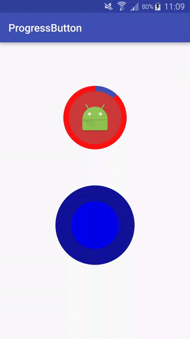

# ProgressButton

A circular progress button for Android that you can use to show indeterminate of determinate progress.



## Features

* Android Min SDK: 16
* Indeterminate and determinate progress
* Customizable backgroundcolor, strokecolor and progresscolor
* Customizable sizes: radius, strokeWidth
* Place an icon on the button
* Customizable animation speed

## Integration

Gradle:
```groovy
dependencies {
    compile 'be.appfoundry.progressbuttonlibrary.progress-button:0.9.1'
}
```

## Usage

<<<<<<< HEAD
```
<be.appfoundry.sampleapp.progressbutton.ProgressButton
=======
In the project you can find a sample app where the use of the button is demonstrated for indeterminate and determinate progress.
For a complete overview of al the view attributes and methods, [click here](README2.md).

Example view implementation:
```
<be.appfoundry.progressbutton.ProgressButton
>>>>>>> c4863e566b0422bfceb57f8277e656e89591c5b4
        android:id="@+id/progressButton"
        android:layout_width="120dp"
        android:layout_height="120dp"
        android:layout_gravity="center"
        progressbutton:fillColor="#ffcd3a3a"
        progressbutton:progressColor="@color/colorPrimary"
        progressbutton:strokeWidth="10dp"
        progressbutton:strokeColor="#FF1010"
        progressbutton:progressIcon="@drawable/ic_settings_remote_white_36dp"
        progressbutton:indeterminate="true"/>
```

Code example:
```
    progressButton.setIndeterminate(true);
    progressButton.setAnimationStep(3);
    progressButton.setAnimationDelay(5);
    progressButton.setStartDegrees(270);

    progressButton.setOnTouchListener(new View.OnTouchListener() {
        @Override
        public boolean onTouch(View v, MotionEvent event) {
            switch (event.getAction()) {
                case MotionEvent.ACTION_DOWN:
                    progressButton.startAnimating();
                    break;
                case MotionEvent.ACTION_UP:
                    progressButton.stopAnimating();
                    break;
            }
            return true;
        }
    });
```

      
## License

```
Licensed under the Apache License, Version 2.0 (the "License");
you may not use this file except in compliance with the License.
You may obtain a copy of the License at

   http://www.apache.org/licenses/LICENSE-2.0

Unless required by applicable law or agreed to in writing, software
distributed under the License is distributed on an "AS IS" BASIS,
WITHOUT WARRANTIES OR CONDITIONS OF ANY KIND, either express or implied.
See the License for the specific language governing permissions and
limitations under the License.
```
